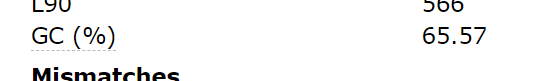

# Bioinformatics Specialization 2 / Assinment 2

## De Nova Assembly

### 2. What is the sequencing technology used and how many reads were generated

Combined Nanopore and Illumina whole-genome sequencing, and was sequenced using a MiSeq platform Illumina and MinION technology Oxford Nanopore. A total of 59,875 reads were generated.

### 3. What is the GC content of the assembled genome? How does that compare to what is mentioned in the paper above?

As we can see from the assembly result after runbning the Quast software on the yeild `contigs.fasta` file, the GC content is 65.57% Which is the same number as the paper mentio0ned.

### 4. How many contigs were generated?

There are 997 contigs generated from the assembly.

\

### 5. What is N50 and NG50 of the assembled genome and what do they mean?

From the report the value of _N50_ is **10400** an the value of _NG50_ is **10400**.

The N50 value is the length of the shortest read such that it will be in the 50% position of the read assymbly. If we assembled all reads from the tallest to the shortest, the N50 read is the one which will be in the middle of the assembled genome. However the NG50 is the same as the N50 but on the level of the reference genome length. Which means when we align all genes assemble in reference to the original genome, the readd that will be exactly at the midddle of the genome is the NG50 read.

**NOTE**: I assumed that the length of the whole genome is the same as the length of the assembled gene to get the NG50 fropm the Quast report.

### 6. What is the size of the assembled genome?

The total length of the assembled genome is **5,433,342**

